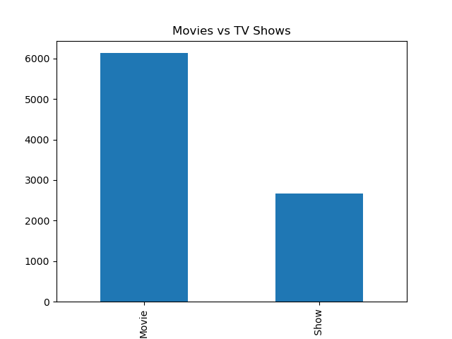
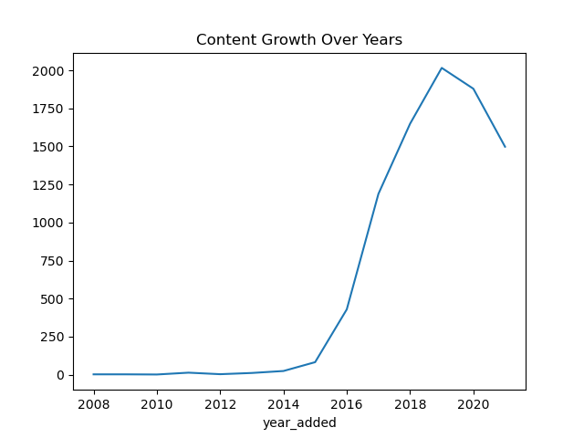

# 🎬 Netflix Recommender System

## 📌 Overview

This project builds a **content-based movie recommender system** using Natural Language Processing (NLP).
It recommends similar movies/shows based on their descriptions.

---

## 🎯 Objective

To recommend relevant Netflix titles by analyzing textual similarity between movie descriptions.

---

## ⚙️ Approach

1. Data Cleaning
2. Exploratory Data Analysis (EDA)
3. Text Processing using TF-IDF
4. Similarity Calculation using Cosine Similarity
5. Recommendation based on similarity scores

---

## 🧹 Data Preprocessing

* Handled missing values:

  * Filled categorical columns with `"Unknown"`
  * Filled rating with mode
* Converted `date_added` into datetime
* Extracted:

  * Year added
  * Month added
* Cleaned text data for NLP

---

## 📊 Exploratory Data Analysis

### Movies vs TV Shows



### Content Growth Over Years



---

## 🧠 Model Explanation

### 🔹 TF-IDF (Term Frequency - Inverse Document Frequency)

* Converts text (movie descriptions) into numerical vectors
* Gives importance to unique words

### 🔹 Cosine Similarity

* Measures similarity between two movies
* Values range from 0 (different) to 1 (very similar)

---

## 🤖 Recommendation System

The system:

* Finds the selected movie
* Calculates similarity with all other movies
* Returns the top 10 most similar titles

### Example:

```python
recommend("Narcos")
```

---

## 💡 Key Insights

* Content similarity can be effectively captured using descriptions
* NLP techniques allow meaningful recommendations without user data
* Recent years show rapid growth in Netflix content

---

## 📂 Project Structure

```text
netflix-recommender-system/
│
├── data/
├── notebook/
│   └── analysis.ipynb
│
├── src/
│   ├── preprocessing.py
│   ├── vectorizer.py
│   ├── similarity.py
│   └── recommender.py
│
├── images/
├── README.md
├── requirements.txt
```

---

## 🚀 How to Run

```bash
pip install -r requirements.txt
jupyter notebook
```

---

## 📌 Future Improvements

* Hybrid recommendation system (content + user-based)
* Use advanced NLP models (BERT, embeddings)
* Build interactive web app (Streamlit)

---

## 💬 Interview Explanation

"I built a content-based recommender system using TF-IDF and cosine similarity.
I converted movie descriptions into vectors and measured similarity to recommend similar titles.
This approach works well because it captures textual relationships between content."

---

## 🏁 Conclusion

* TF-IDF effectively captures textual patterns
* Cosine similarity provides meaningful recommendations
* The system works without needing user data
* Can be extended into a real-world recommendation engine

