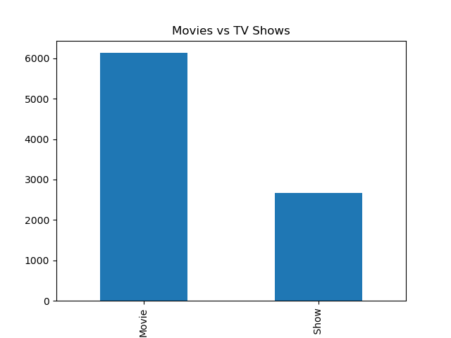
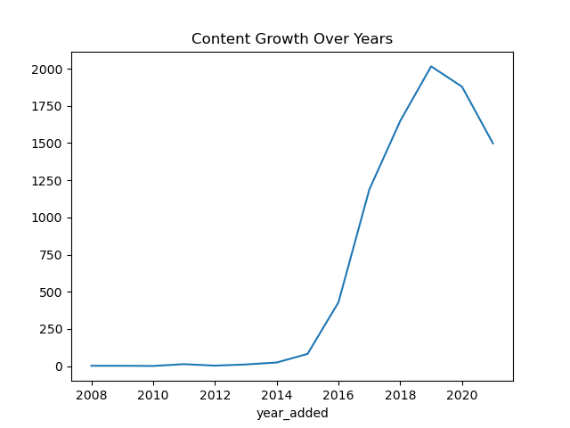

# 🎬 Netflix Recommender System

> A content-based movie & show recommender built with NLP — recommending titles purely from what they're about, no user data needed.

---

## 📌 Overview

This project builds a **content-based recommender system** for Netflix titles using Natural Language Processing. By converting movie and show descriptions into numerical vectors and measuring textual similarity, the system recommends the most relevant titles — without relying on user history or ratings.

It demonstrates a practical, real-world application of NLP: the same core technique used by platforms like Netflix, Spotify, and YouTube to power their "More like this" features.

---

## 🎯 Objective

To recommend similar Netflix movies and TV shows based purely on content descriptions — using TF-IDF vectorization and Cosine Similarity to find titles that share the most meaningful textual overlap.

---

## 📂 Dataset

The dataset contains Netflix catalogue information including:

| Feature | Description |
|---|---|
| `title` | Movie / TV show name |
| `type` | Movie or TV Show |
| `description` | Text description (used for NLP) |
| `listed_in` | Genre categories |
| `director`, `cast` | People involved |
| `country` | Country of origin |
| `date_added` | When added to Netflix |
| `rating` | Content rating |

---

## ⚙️ Workflow

```
Raw Data → Cleaning → EDA → Text Processing (TF-IDF) → Cosine Similarity → Recommendations
```

1. Data Cleaning & Preprocessing
2. Exploratory Data Analysis (EDA)
3. Text Processing using TF-IDF
4. Similarity Calculation using Cosine Similarity
5. Recommendation Generation (Top 10 similar titles)

---

## 🧹 Data Preprocessing

Careful cleaning was applied before any modelling:

- Missing categorical values filled with `"Unknown"`
- Rating column filled with mode
- `date_added` converted to datetime format
- Extracted `year_added` and `month_added` as separate features
- Text descriptions cleaned and standardised for NLP processing

---

## 🧠 How the Model Works

### Step 1 — TF-IDF (Term Frequency - Inverse Document Frequency)

TF-IDF converts each movie description into a numerical vector. It gives higher weight to words that are unique and meaningful to a specific title, and lower weight to common words that appear everywhere (like "the", "a", "is").

```
TF(word) = (occurrences of word in doc) / (total words in doc)
IDF(word) = log(total docs / docs containing word)
TF-IDF = TF × IDF
```

The result: every movie becomes a vector of numbers representing what it's actually about.

### Step 2 — Cosine Similarity

Cosine Similarity measures the angle between two vectors in multi-dimensional space. The closer the angle to 0°, the more similar the two titles are.

```
Similarity = cos(θ) = (A · B) / (|A| × |B|)
```

- Score of **1.0** → identical content
- Score of **0.0** → completely different

### Step 3 — Recommendation

For any given title, the system:
1. Retrieves its TF-IDF vector
2. Calculates cosine similarity against all other titles
3. Returns the **top 10 most similar** titles ranked by score

---

## 🤖 Example Output

```python
recommend("Narcos")
```

Returns the 10 Netflix titles most similar to Narcos based on description — crime dramas, biographical stories, and shows with similar themes and tone.

---

## 📊 Exploratory Data Analysis

### Movies vs TV Shows Distribution


### Netflix Content Growth Over the Years


> **Key finding:** Netflix content grew rapidly from 2015–2019, with movies consistently outnumbering TV shows in the catalogue.

---

## 💡 Key Insights

- **Descriptions alone are powerful** — TF-IDF captures meaningful thematic similarity without any user behaviour data
- **No cold-start problem** — unlike collaborative filtering, this system works immediately for any title in the dataset
- **NLP beats manual tagging** — the model finds thematic connections human-assigned genres often miss
- **Netflix content exploded post-2015** — the dataset shows rapid catalogue growth, making recommendation systems increasingly important
- **Privacy-friendly** — zero user data required; recommendations are based entirely on content

---

## 📁 Project Structure

```
netflix-recommender-system/
│
├── data/                    # Raw Netflix dataset
├── images/                  # EDA visualisations
├── notebook/
│   └── analysis.ipynb       # Full analysis notebook
├── src/
│   ├── preprocessing.py     # Data cleaning pipeline
│   ├── vectorizer.py        # TF-IDF vectorisation
│   ├── similarity.py        # Cosine similarity computation
│   └── recommender.py       # Recommendation engine
├── README.md
└── requirements.txt
```

---

## 🚀 How to Run

```bash
# Clone the repository
git clone https://github.com/Lochank52/netflix-recommender-system.git
cd netflix-recommender-system

# Install dependencies
pip install -r requirements.txt

# Launch the notebook
jupyter notebook
```

---

## 🔮 Future Improvements

- [ ] Hybrid system combining content-based + collaborative filtering
- [ ] Use BERT or sentence embeddings for richer text understanding
- [ ] Include cast, director, and genre in the similarity vector
- [ ] Build an interactive Streamlit web app
- [ ] Evaluate recommendation quality with precision/recall metrics

---

## 💬 Interview Summary

*"I built a content-based recommender system for Netflix titles using TF-IDF and Cosine Similarity. The idea is simple but powerful — convert each title's description into a vector, then measure how close any two vectors are. The closer they are, the more similar the content. What makes this interesting is it requires zero user data, so there's no cold-start problem. Given a title like Narcos, it returns the 10 most thematically similar shows based purely on what they're about."*

---

## 👤 Author

**Lochan Kumar Yamala**   
📧 lochank1998@gmail.com  
🔗 [GitHub](https://github.com/Lochank52) | [LinkedIn](#)

---

*⭐ If you found this project useful, consider giving it a star!*